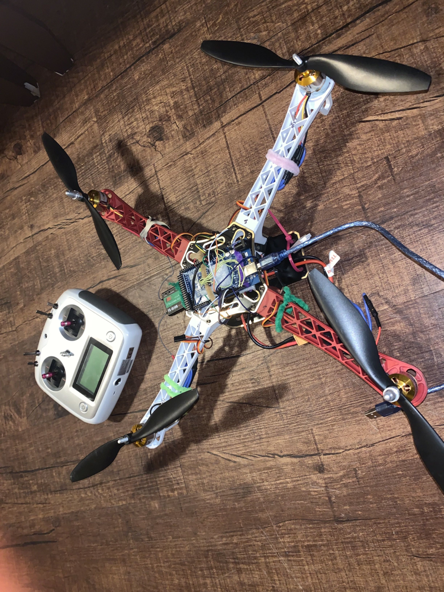

# Quadcopter-Flight-Controller
   
FlightControllerMock1.0:
- Is the main software to make a quadcopter fly
- This software is made for a quadcopter with 2560 mega arduino board, as the flight controller
   
IMU_Board
- Is a program that will print the pitch and roll angle of the IMU accuratly in 3-D space
   
 Kill_Switch_Test:
- Test the kill switch for channel 8 of the transmitter
     
 Test_ESC_WithServo:
- Test each motor with the servo library
     
TransmitterOutputAll:
- Print all the values from recieved from the transmitter

